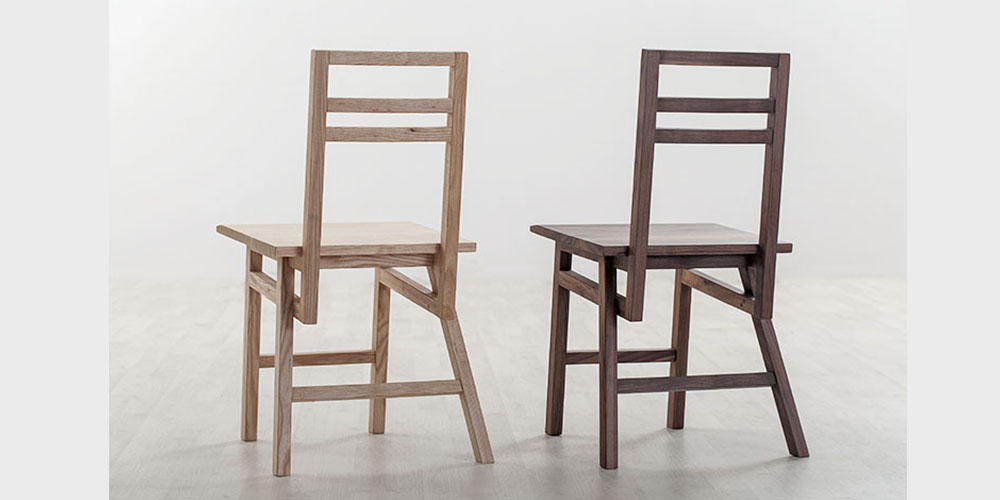

# Pinch-zoom

Pinch an image or div for zoom.

Visit [Demo](https://chemzqm.github.io/pinch-zoom) with your phone.


## Features

* Pinch to zoom, tested on ios > 9.2 and android 4.0
* Scale back with animation when exceed maximun scale level ( default 5).
* Drag element with animation and sceen edge limitation.
* Support tap to reset transform status with animation.
* Reset transform status when scale level below zero.
* Restore to sane position when insane padding exists.
* Emit `tap` and `swipe` event when reasonable.
* No interrapt with `touchmove` event when not scaled and move left/right.
* Use 3d transform when possible and requestAnimationFrame to improve
  performance.
* Built with reusable & lightweight components, no sucks jquery.

## Installation

    npm install pinch-zoom

## Example

``` css
#viewport {
  width: 100vw;
  height: 100vh;
  position: relative;
  background-color: #000;
  overflow: hidden;
}
.wrapper {
  position: absolute;
  left: 0;
  right: 0;
  top: 50%;
  margin-top: -80px;
}
.wrapper > img {
  width: 100%;
  display: block;
  height: auto;
}
```

``` html
<div id="viewport">
  <div class="wrapper">
    
  </div>
</div>
```

``` js
var pinchZoom = require('pinch-zoom')
var el = document.querySelector('.wrapper')
var pzoom = pinchZoom(el, {
  draggable: true,
  maxScale: 4
})
```

## Events

* `tap` emitted when double tap or scale level is 1.
* `swipe` emitted with direction `left` or `right` when fast swipe detected.
* `scale` emitted with current transform properties (x, y , scale) after pinch
  or reset.
* `end` emitted on pinch end.
* `start` emitted on pinch start.

## API

### PinchZoom(el , [opt])

Init PinchZoom with element and optional opt, `el` should not have `transform`
and `transition` style.

* `opt.tapreset` reset transoform if scale is not `1` and not double tap.
* `opt.maxScale` maximun scale for element, default `5`.
* `opt.draggable` make element draggable with one finger, default `false`.
* `opt.threshold` threshold for fast swipe event in ms, default `200`
* `opt.fastThreshold` minimal moved distance for fast swipe in pixel, default `40`

### .animate(o, duration, [ease])

Animation base element with options.

* `o.x` translateX.
* `o.y` translateY.
* `o.scale` value for `scale()` or `scale3d()`.
* `duration` animation duration in ms.
* `ease` ease function name, default `out-circ`

### .reset()

Reset to initial state with animation.

### .unbind()

Reset trasform style and unbind all events.

## LICENSE

  Copyright 2016 chemzqm@gmail.com

  Permission is hereby granted, free of charge, to any person obtaining
  a copy of this software and associated documentation files (the "Software"),
  to deal in the Software without restriction, including without limitation
  the rights to use, copy, modify, merge, publish, distribute, sublicense,
  and/or sell copies of the Software, and to permit persons to whom the
  Software is furnished to do so, subject to the following conditions:

  The above copyright notice and this permission notice shall be included
  in all copies or substantial portions of the Software.

  THE SOFTWARE IS PROVIDED "AS IS", WITHOUT WARRANTY OF ANY KIND,
  EXPRESS OR IMPLIED, INCLUDING BUT NOT LIMITED TO THE WARRANTIES
  OF MERCHANTABILITY, FITNESS FOR A PARTICULAR PURPOSE AND NONINFRINGEMENT.
  IN NO EVENT SHALL THE AUTHORS OR COPYRIGHT HOLDERS BE LIABLE FOR ANY CLAIM,
  DAMAGES OR OTHER LIABILITY, WHETHER IN AN ACTION OF CONTRACT,
  TORT OR OTHERWISE, ARISING FROM, OUT OF OR IN CONNECTION WITH THE SOFTWARE
  OR THE USE OR OTHER DEALINGS IN THE SOFTWARE.
